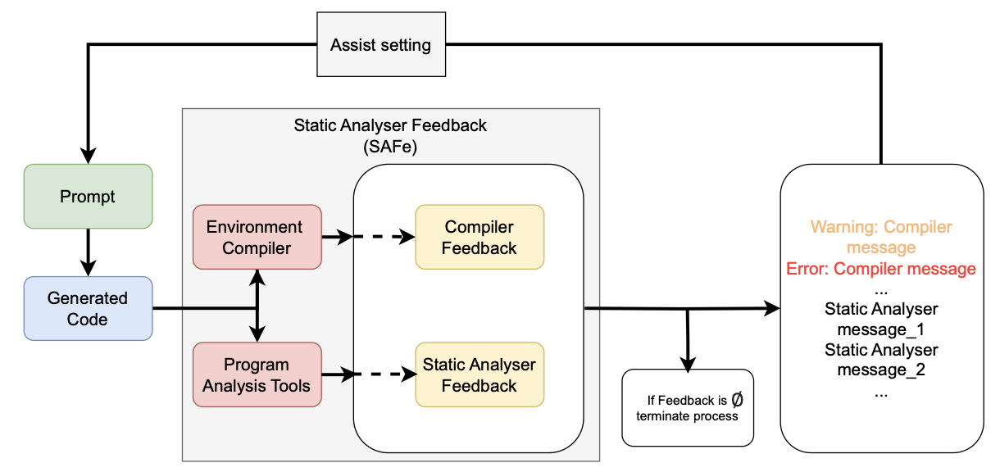
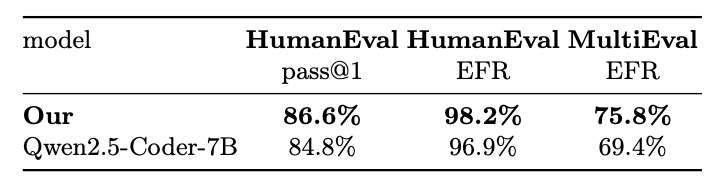
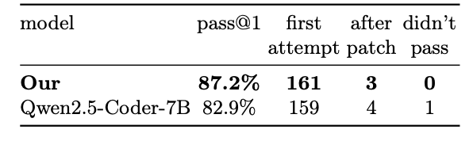

<h1 align="center">Code Generation LM Evaluation Harness</h1>


<h4 align="center">
    <p>
        <a href="https://huggingface.co/bigcode">BigCode</a>
    <p>
</h4>

<h3 align="center">
    </a>
</h3>

## CodePatchLLM + bigcode-evaluation-harness
Для повышения качества и надежности кода, генерируемого LLM моделями, представляется возможным использование цикла улучшения кода (или перегенерации) с применением обратной связи от различных анализаторов программного кода (в данном проекте в качестве таких анализаторов выступают SAST Svace и анализатор кода на безопасность Bandit). Для оценки работоспособности данного подхода, получения метрик, а также дообучения, данный механизм был встроем в фреймворк bigcode-evaluation-harness, предназначенный для универсальной оценки кодо-генерирующих LLM на различных датасетах.

## Принцип работы
- В [`bigcode_eval/program_analysis.py`](https://github.com/meder1ss/bigcode-patch-eval/blob/main/bigcode_eval/program_analysis.py) прописаны функции, выполняющие анализ программного кода. В данный момент поддерживается анализ с помощью утилиты статического анализа [Svace](https://www.ispras.ru/technologies/svace/), анализа на безопасность [Bandit](https://github.com/PyCQA/bandit), а также динамического анализа [Valgrind](https://valgrind.org). Для добавления новой утилиты требуется добавить в скрипт функцию, осуществляющую соответствующий вызов по аналогии.
- В [`bigcode_eval/utils.py`](https://github.com/meder1ss/bigcode-patch-eval/blob/main/bigcode_eval/utils.py) заложен основной механизм улучшения: из предварительно сохраненных файлов с результатами анализа считываются рекомендации по улучшению кода, которые преобразуются в промпт для модели. В данный момент поддерживается формат создания Instruct промптов, однако аналогичный механизм может быть применен и к обычным текстовым промптам.
- В [`main.py`](https://github.com/meder1ss/bigcode-patch-eval/blob/main/main.py) прописаны основные циклы, осуществляющие итеративный анализ, улучшение и сохранение промежуточных результатов. Реализованы две функции - static_analyzis_cycle и bandit_analyzis_cycle, выполняющие улучшение кода с помощью соответствующих инструментов, однако возможно использование комплекса инструментов для более надежного улучшения. Ниже представлен схематичный принцип работы цикла улучшения кода. 


## Запуск на датасете
Запуск оценки модели на датасете осуществляется с помощью скрипта [`main.py`](https://github.com/meder1ss/bigcode-patch-eval/blob/main/main.py). Для использования утилиты Svace для анализа при запуске main.py передается аргумент --static_analyze, максимальное количество эпох для генерации с учетом ответа от статического анализатора задается через аргумент --static_analyze_epochs <int> (по умолчанию выставляется в значение 3), аналогичный аргумент должен быть выставлен при использовании анализатора Bandit: --bandit_analyze, для него также можно указать максимальное количество эпох для генерации --bandit_analyze_epochs <int> (по умолчанию выставляется в значение 3). Также при запуске можно передать аргумент --separate_dirs, при выставлении которого все решения LLM будут сохраняться в отдельные папки по номеру задания из датасета, данный механизм полезен при отладке и повышает прозрачность процесса. Помимо этого, возможно использование дообученной модели, для этого требуется передать вместе с аргументом --peft_model путь к весам в локальном хранилище.
Пример запуска:  
```
python3 main.py \
    --model Qwen/Qwen2.5-Coder-7B-instruct
    --peft_model ./results/checkpoint \
    --trust_remote_code \
    --allow_code_execution \
    --tasks instruct-humaneval \
    --prompt instruct \
    --bandit_analyze \
    --static_analyze \
    --instruction_tokens '<user_token>,<end_token>,<assistant_token>'
```
## Запуск веб-интерфейса
Для запуска пользовательского интерфейса используется скрипт [`backend/app.py`](https://github.com/meder1ss/bigcode-patch-eval/blob/main/backend/app.py). Данный интерфейс предоставляет возможность оценить модель на датасете, а также сгенерировать решение для отдельной задачи (для этого реализовано отдельное окошко чата с моделью), при этом пользователь может сам выбрать какую модель использовать, какие инструменты подключить и в течении скольких эпох валидировать решение засчет интуитивно понятного GUI. По умолчанию пользовательский интерфейс работает на порту 5688.
Пример запуска:  
```
python3 app.py
```

## Датасет для оценки моделей MultiEval
В качестве дополнительного инструмента оценки качества моделей был собран небольшой датасет, состоящий из задач, на которых модели семейства Qwen чаще всего допускали ошибки и неточности. Данный датасет получил название MultiEval. Для создания датасета использовались следующие модели: Qwen2.5-Coder-7B, Qwen2.5-Coder-3B, Qwen2.5-Coder-1.5B в Instruct и обычных форматах, а также модели Qwen2.5-3B, Qwen2.5-7B и Qwen2.5-14B. Данные модели решали задачи из датасетов:  APPS-Interview и APPS-Introductory, StudentEval, Mercury, CoNaLa, MBPP, DS-1000. В результате анализа результатов и отбора задач был получен датасет, содержащий 376 промптов. Такой подход позволил сформировать набор данных, охватывающий различные проблемы генерации кода, а также позволил осуществлять оценку дообученной модели на максимально репрезентативной выборке задач.

## Дообучение
Для повышения надежности кода, генерируемого с помощью LLM моделей были произведены эксперименты с дообучением модели. В [`finetuning/rlhf_qwen_code_preference.py`](https://github.com/meder1ss/bigcode-patch-eval/blob/main/finetuning/rlhf_qwen_code_preference.py) отображены параметры и датасет [Code-Preference-Pairs](https://huggingface.co/datasets/Vezora/Code-Preference-Pairs), на котором производилось дообучение модели Qwen2.5-Coder-7B-Instruct при помощи Direct Preference Optimization RLHF метода. При данных параметрах в течении трех эпох данная модель обучилась и показала хороший результат на валидации, ключевые метрики отображены в json файлах с результатами для оригинальной и дообученной моделей соответственно - [`results/evaluation_results_Qwen2.5-Coder-7B.json`](https://github.com/meder1ss/bigcode-patch-eval/blob/main/results/evaluation_results_Qwen2.5-Coder-7B.json) и [`results/evaluation_results_finetuned_model.json`](https://github.com/meder1ss/bigcode-patch-eval/blob/main/results/evaluation_results_finetuned_model.json). Дообученные веса находятся в [`results/checkpoint`](https://github.com/meder1ss/bigcode-patch-eval/blob/main/results/checkpoint) соответственно. В таблицах ниже представлены метрики на датасетах HumanEval и MultiEval (наш). EFR (Error-Free Rate) в данном случае - метрика, показывающая какая часть задач от общего количества была решена правильно (с нулевым флагом от Svace) с первой попытки.



## Документация
Подробная документация к фреймворку bigcode-evaluation-harness с перечислением доступных датасетов доступна в [`docs/README.md`](https://github.com/bigcode-project/bigcode-evaluation-harness/blob/main/docs/README.md).

## Acknowledgements
We thank EleutherAI for their work on the [lm-evaluation harness](https://github.com/EleutherAI/lm-evaluation-harness) from which this repository is inspired.

## Cite as

```
@misc{bigcode-evaluation-harness,
  author       = {Ben Allal, Loubna and
                  Muennighoff, Niklas and
                  Kumar Umapathi, Logesh and
                  Lipkin, Ben and
                  von Werra, Leandro},
  title = {A framework for the evaluation of code generation models},
  publisher = {GitHub},
  journal = {GitHub repository},
  howpublished = {\url{https://github.com/bigcode-project/bigcode-evaluation-harness}},
  year = 2022,
}
```
